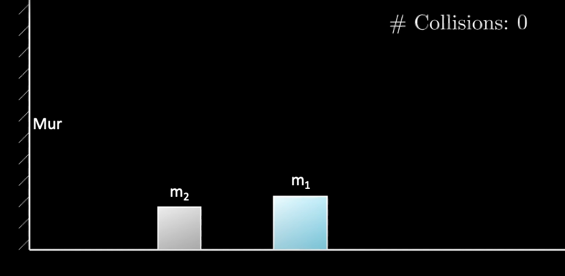
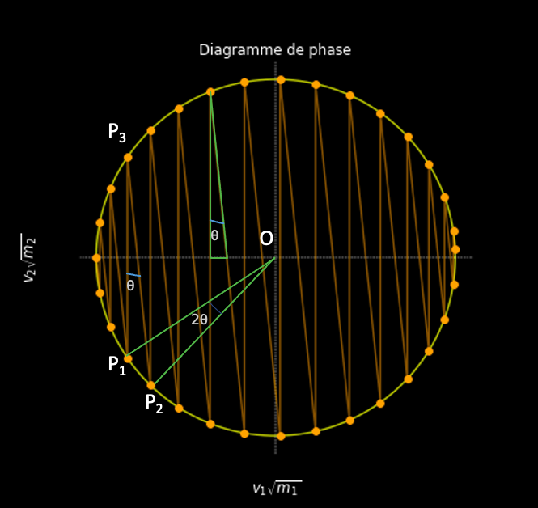

# Collisions Elastiques

Ce projet consiste à reproduire la simulation de cette [vidéo [1]](https://youtu.be/HEfHFsfGXjs?si=t0XWsMkiTgWax-KG) et à démontrer le résultat sur le nombre de collisions.

On se basera notamment sur les traveaux de G. Galepin dans Playing Pool with $\pi$ [[2]](https://www.maths.tcd.ie/%7Elebed/Galperin.%20Playing%20pool%20with%20pi.pdf).
### Exemple
Pour les paramètre de simulation suivants:

- rapport $\frac{m_1}{m_2} = 100$ ;
- $v_1 = -2 fps$ (vitesse initiale de $m_1$) ;
- $v_2 = 0 fps$ (vitesse initiale de $m_2$)
  
La simulation donne (vidéo accélérée):

  

## Formules pour simuler les collisions

Le système se présente comme suit :

- Deux masses $m_1$ et $m_2$ de forme rectangulaires;
- Un mur;
- Un sol;
- Un compteur de collision.

  

*Figure 1: Schéma du système [[1]](https://youtu.be/HEfHFsfGXjs?si=t0XWsMkiTgWax-KG).*

Sous couvert des hypothèses suivantes:

- Les collisions sont élastiques : il n'y a pas de perte d'énergie ;
- Le mouvement est unidimensionnel suivant $x$ (horizontale): il n'y a pas de mouvement dans les directions $y$ et $z$ ;
- Le mur constituant la base a une masse infinie ;
- Le sol est parfaitement lisse : il n'y a pas de perte d'énergie par frottement.

On note $v_1$ et $v_2$ les vitesses des masses respectives à un instant donné et $v_1'$ et $v_2'$ les vitesses de ces masses à l'instant suivant. Les hypothèses précédentes ainsi que les conventions nous permettent d'avoir d'une part la conservation de la quantité de mouvement et d'autre part la conservation de l'énergie cinétique qui s'écrivent:

$$
\
\begin{cases}
m_1 v_1 + m_2 v_2 = m_1 v_1' + m_2 v_2' \\
\frac{1}{2} m_1 v_1^2 + \frac{1}{2} m_2 v_2^2 = \frac{1}{2} m_1 v_1'^2 + \frac{1}{2} m_2 v_2'^2
\end{cases}
\
$$

 Et permettent d'aboutir aux expréssions de $v_1'$ et $v_2'$ suivantes :

$$
\
\ v_1' = \frac{(m_1 - m_2)v_1 + 2m_2v_2}{m_1 + m_2} \
$$
$$
\ v_2' = \frac{(m_2 - m_1)v_2 + 2m_1v_1}{m_1 + m_2} \
$$

On peut ainsi simuler les collisions avec ces vitesses, sachant qu'une collision avec le mur change simplement le sens du vecteur vitesse mais conserve la norme.

## Nombre de collisions

On adopte une approche géométrique qui consiste à tracer le cercle des énergies possibles lors de l'expérience, ce qui est possible grace à la conservation de l'énergie cinétique du système. On réécrit l'équation de conservation d'énergie pour faire apparaitre une équation de cercle:

$$
\frac{1}{2} (\sqrt{m_1}v_1)^2 + \frac{1}{2} (\sqrt{m_2}v_2)^2 = cst
$$

La constante (et donc le carré du rayon), sera prise égale à l'énergie initiale $\frac{1}{2}m_1v_1^2$.

La première énergie du système est son énergie au repos représenté sur le cercle d'énergie aux coordonnées $(v_1 \sqrt{m_1}, v_2 \sqrt{m_2})$. Les autres points se déduisent dans le cas de la simulation par simple calcul des vitesses avec les formules écrites précedemment ou analytiquement en observant qu'à cause de conservation de la quantité de mouvement ($m_1 v_1 + m_2 v_2 = m_1 v_1' + m_2 v_2'$) le point d'énergie après collision est sur la droite de pente $-\sqrt{\frac{m_1}{m_2}}$ passant par le point d'énergie avant collision.

On peut alors observer que les arcs de cercles entre chaque points sont de mêmes longueurs (sans tenir compte du dernier arc entre le point de sortie et dernière collision avec le mur). On peut s'en convaincre de la manière suivante:

- Pour chaque points $P_1$, $P_2$ et $P_3$ tels que $P_3$ n'appartient pas à l'arc délimité par $P_1$ et $P_2$, l'angle $\theta$ formé est le même (il s'agit à chaque fois de l'angle entre la verticale et une droite de pente $-\sqrt{\frac{m_1}{m_2}}$);
- D'après le théorème de l'angle inscrit, $P_3$ étant situé en dehors de l'arc délimité par $P_1$ et $P_2$, l'angle formé par $P_1$, $P_2$ et $O$ (le centre du cercle) est égal à $2θ$. Donc la longueur de de l'arc délimité par $P_1$ et $P_2$ est $2θr$ (avec r le rayon du cercle $r = \sqrt{m_1v_1^2}$), et ce à chaque fois.

  

*Figure 2: Schématisation des points.*

Le nombre de collisions est alors le nombre maximal d'arcs de cercles de même longueur que l'on a sur ce diagramme de phase. Donc en notant $C \in \mathbb{N}^*$ le nombre de collisions, on peut écrire: $$C.2.\theta.r \leq 2.\pi.r$$

On remarque également que $\theta$ peut s'écrire:

$$
\theta = \arctan\left(\sqrt{(\frac{m_2}{m_1})}\right)
$$

Or on sait que:

$$
\arctan(x) \approx x \quad \text{lorsque } x \to 0.
$$

Donc, s'il existe $n \in \mathbb{N}^*$ tel que $\frac{m_1}{m_2} = 100^n$, on peut écrire :

$$
\theta = \sqrt{(\frac{m_2}{m_1})}
$$

Car $$\sqrt{\frac{m_2}{m_1}} \leq 0.1$$
Enfin, on a donc d'une part l'équation précédente et d'autre part en notant $C$ le nombre de collisions:

$$
C.\sqrt{(\frac{m_2}{m_1})} \leq \pi
$$

ie:

$$
C.\frac{1}{100^n} \leq \pi \iff C \leq 100^n.\pi
$$

Or, on aussi:

$$ 100^n.\pi < C + 1 $$ 

(Sinon on aurait un autre arc de cercle de longueur $2.\theta.r$, ce qui est impossible)

Donc on a:

$$ C \leq 100^n.\pi < C + 1 $$

Donc par définition de la partie entière, on a:

$$
C = \lfloor 100^n.\pi \rfloor
$$

Ce qui achève la démonstration.

## Références

[1]: La réponse la plus inattendue à un casse-tête de comptage. 3Blue1Brown.

[2]: G. Galperin. Playing Pool with $\pi$ (The Number $\pi$ from a Billiard Point of View). 2003.
